# GlobalTrade Logistics — End-to-End Flow Diagrams

Companion to [`E2E_TEST_PLAN.md`](./E2E_TEST_PLAN.md) — one diagram per flow (or group of closely related flows) from that document, in the same order. Flowcharts show the user-facing decision path; the three cross-actor chains (§7) also get a sequence diagram showing which frontend/actor talks to which endpoint, in order.

---

## 1. `frontend-customer` Flows

### Guest landing → sign-up → profile completion (TC-C02, TC-C03)

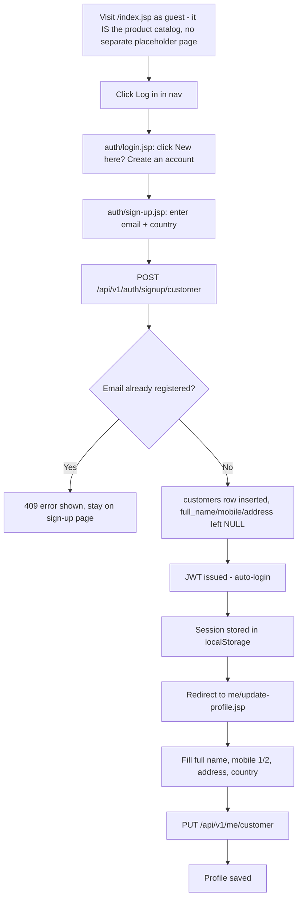

### Returning customer OTP login (TC-C04)

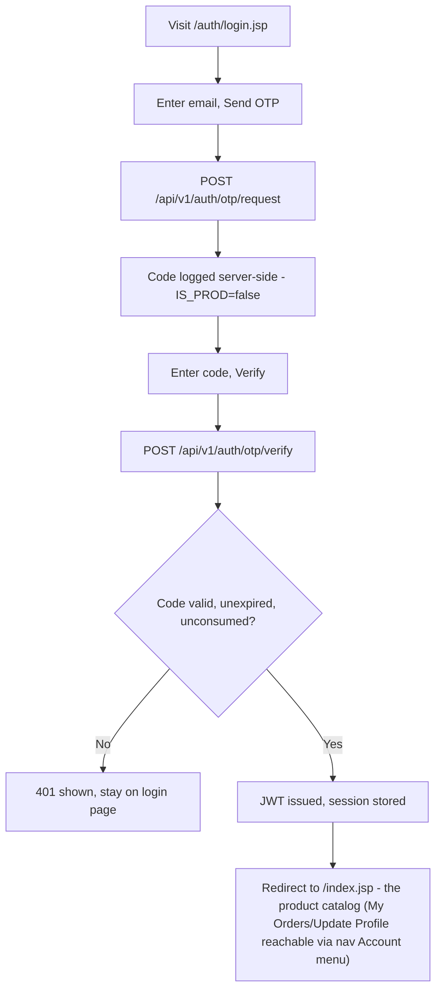

### Browse products (TC-C06)

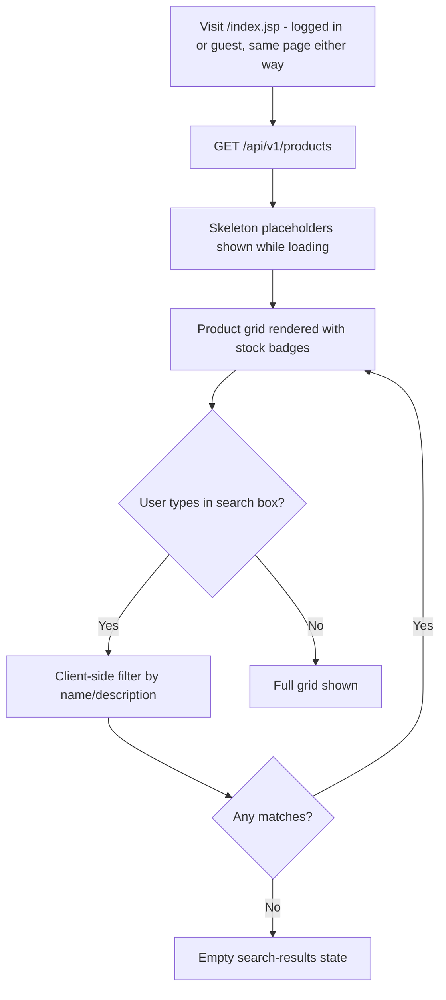

### Place an order (TC-C07, TC-C08, TC-C09)

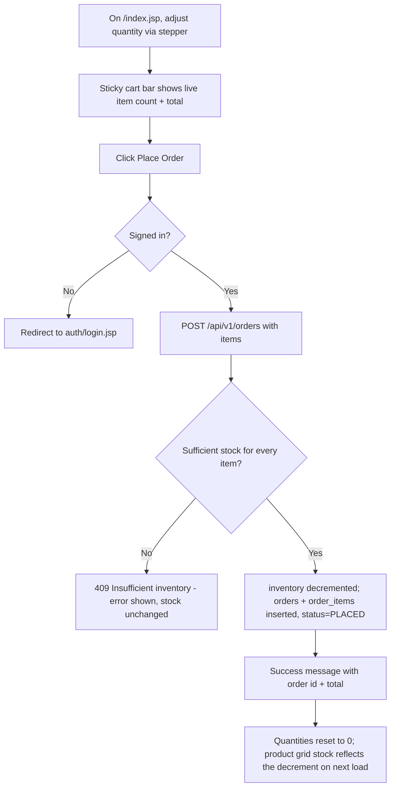

### Order history (TC-C10)

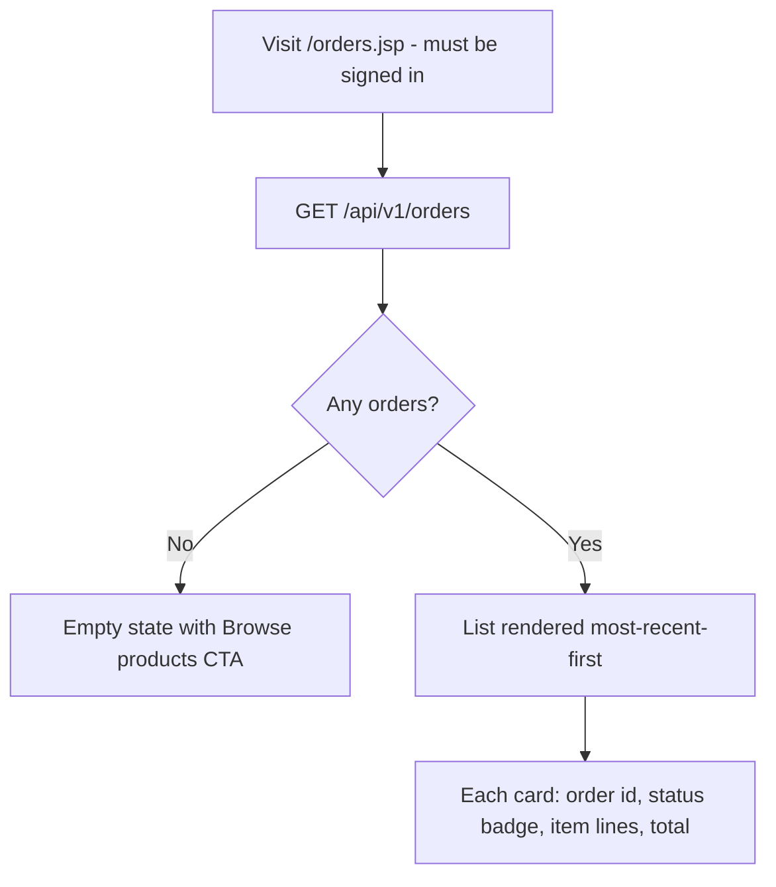

---

## 2. `frontend-seller` Flows

### Supplier sign-up → profile completion (TC-SE02, TC-SE03, TC-SE05)

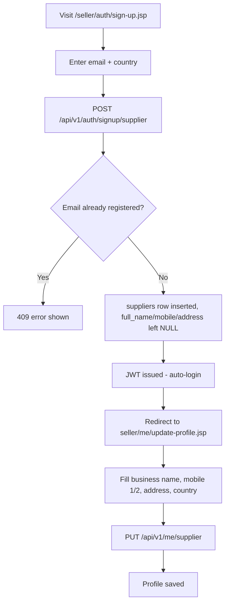

### Returning seller OTP login — profile-aware redirect (TC-SE04)

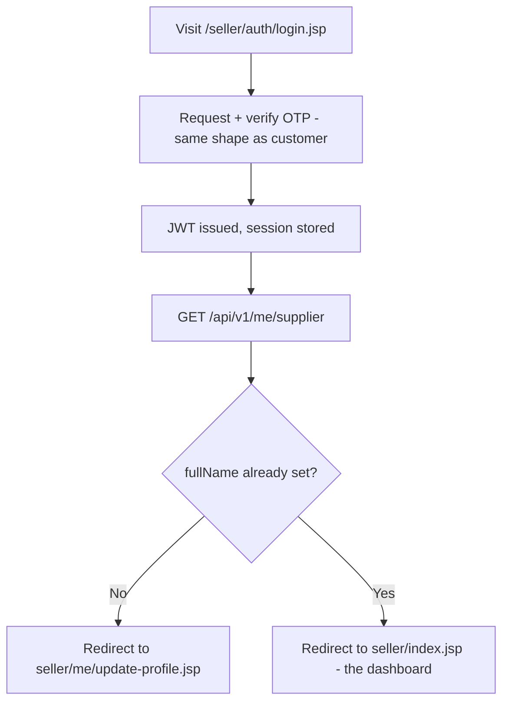

### Add a product offering (TC-SE06)

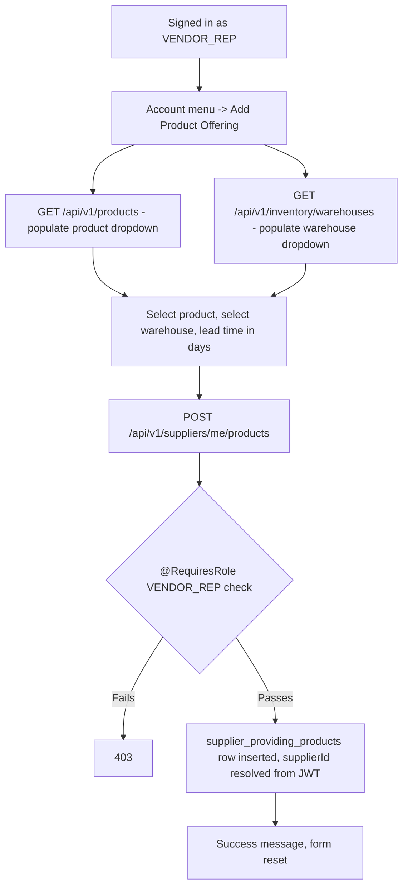

### My Purchase Orders (TC-SE07, TC-SE08)

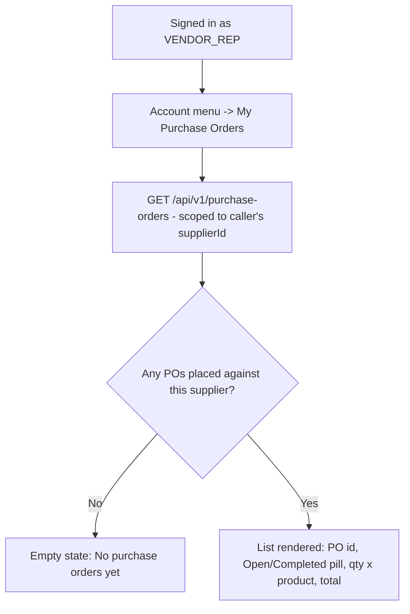

### Create Shipment (TC-SE10)

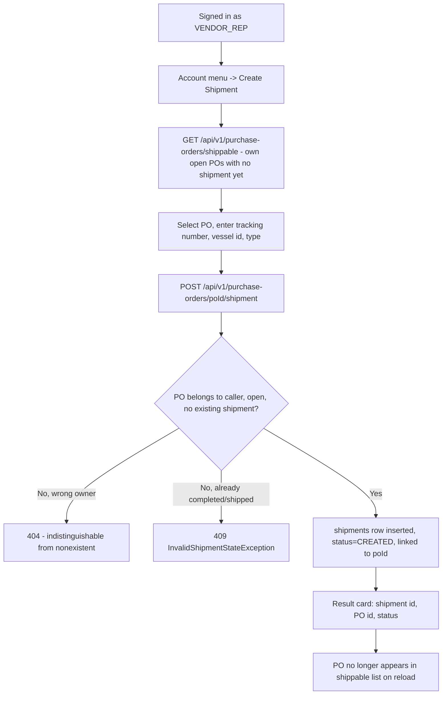

### My Shipments (TC-SE11)

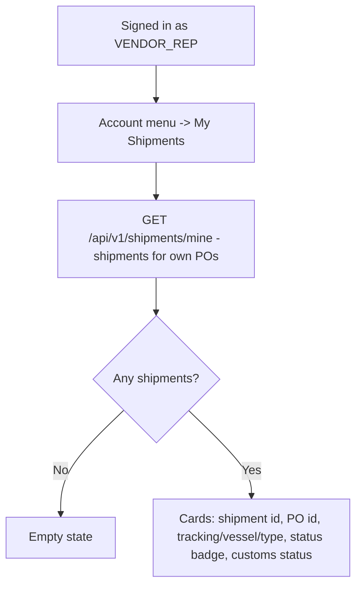

---

## 3. `frontend-app` (Staff Console) Flows

### Staff OTP login → role-based dashboard (TC-A01, TC-A02)

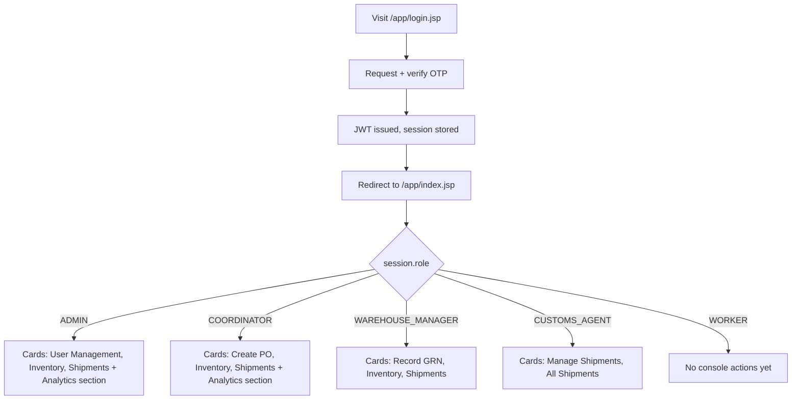

*Note: "Vendor Performance Report" was removed as a dashboard **card** for ADMIN/COORDINATOR but remains reachable from the nav's Account menu — an intentional asymmetry, not a bug.*

### ADMIN: onboard a staff user (TC-A04)

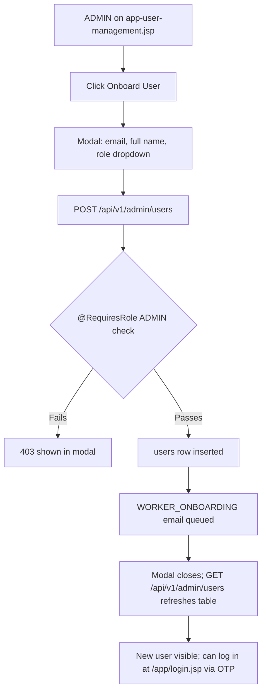

### ADMIN: register a customer or supplier directly (TC-A05, TC-A06)

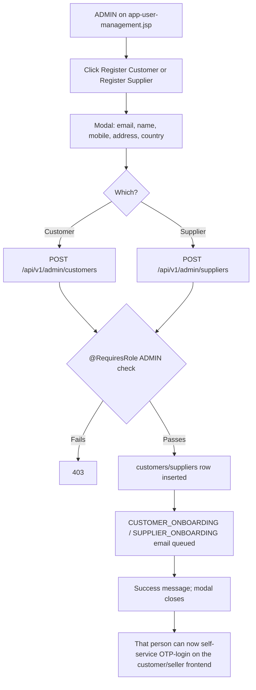

### Vendor Performance Report (TC-A08)

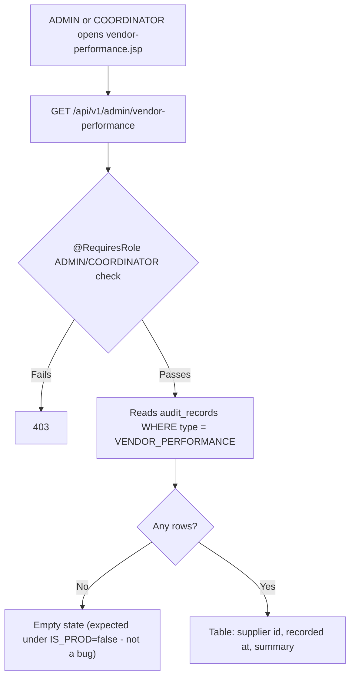

### Warehouse Inventory (TC-A09)

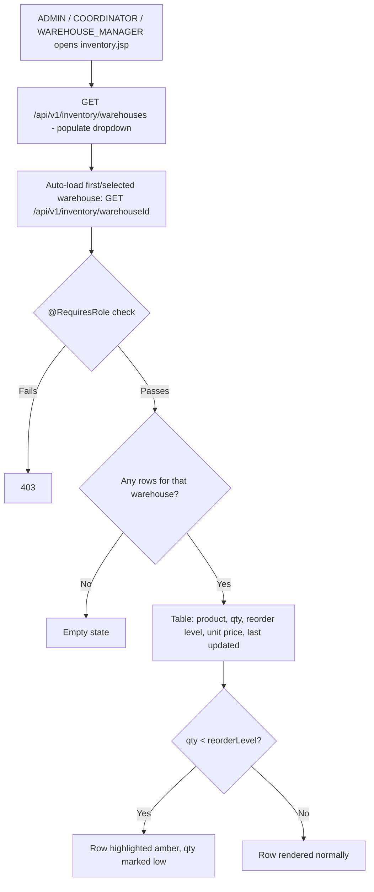

### COORDINATOR: create a purchase order, scoped supplier dropdown (TC-A11)

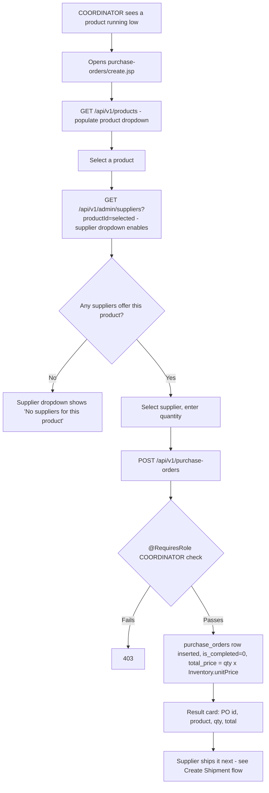

### Ship -> Customs -> GRN pipeline (TC-A13, TC-A16, TC-A17)

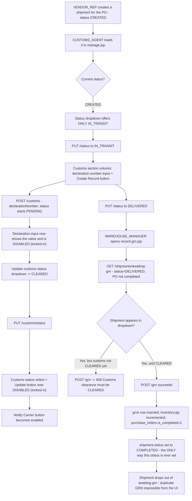

### CUSTOMS_AGENT: manage a shipment, dropdown + state-gated controls (TC-A16, TC-A17, TC-A18)

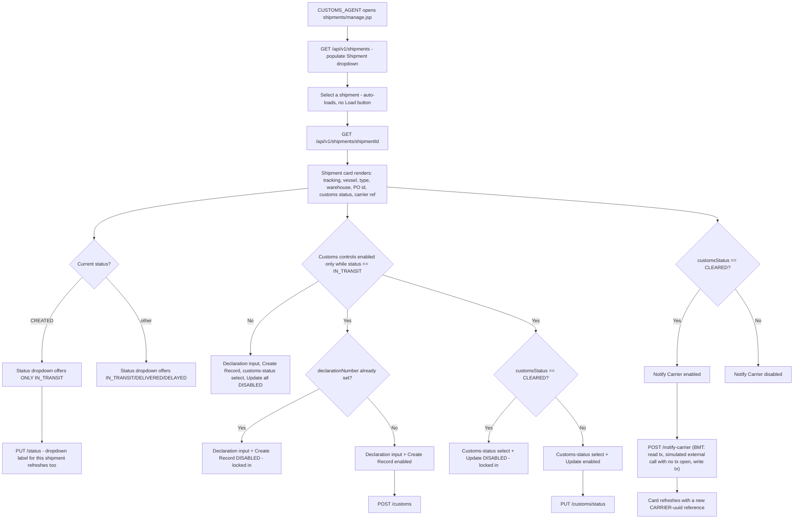

### Role-based page access (CC-5, TC-A12/14/19)

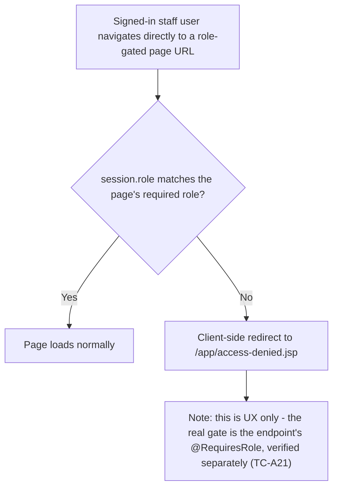

---

## 4. Cross-Actor Integration Chains (§7 of the test plan)

### TC-X01 — Full procurement chain (create PO → ship → customs → GRN)

See [`E2E_TEST_FLOW.md`](./E2E_TEST_FLOW.md) for the fully verified, field-by-field version of this chain (29 test points). Summarized here:

```mermaid
flowchart TD
    A[VENDOR_REP adds a product offering] --> B[COORDINATOR creates a PO against that supplier/product]
    B --> C[VENDOR_REP creates a shipment for that PO]
    C --> D[CUSTOMS_AGENT: CREATED -> IN_TRANSIT, customs record CLEARED, then -> DELIVERED]
    D --> E[WAREHOUSE_MANAGER records a GRN for that shipment]
    E --> F[grns row inserted; inventory.qty incremented; purchase_orders.is_completed=1; shipment.status=COMPLETED]
    F --> G[VENDOR_REP reloads My Purchase Orders - sees Completed; My Shipments - sees COMPLETED]
    F --> H[ADMIN/COORDINATOR reloads Warehouse Inventory - sees increased qty]
```

```mermaid
sequenceDiagram
    participant Seller as Browser (frontend-seller, VENDOR_REP)
    participant Coord as Browser (frontend-app, COORDINATOR)
    participant Customs as Browser (frontend-app, CUSTOMS_AGENT)
    participant WM as Browser (frontend-app, WAREHOUSE_MANAGER)
    participant GW as api-gateway
    participant DB as MySQL

    Seller->>GW: POST /v1/suppliers/me/products {productId, warehouseId, leadTimeInDays}
    GW->>DB: INSERT supplier_providing_products

    Coord->>GW: GET /v1/admin/suppliers?productId={id}
    GW-->>Coord: [suppliers offering this product]
    Coord->>GW: POST /v1/purchase-orders {supplierId, productId, qty}
    GW->>DB: INSERT purchase_orders (is_completed=0)
    GW-->>Coord: PurchaseOrderSummary (poId)

    Seller->>GW: GET /v1/purchase-orders/shippable
    GW-->>Seller: [PO appears - open, no shipment yet]
    Seller->>GW: POST /v1/purchase-orders/{poId}/shipment {trackingNumber, vesselId, type}
    GW->>DB: INSERT shipments (status=CREATED, purchase_orders_po_id={poId})
    GW-->>Seller: ShipmentSummary (shipmentId)

    Customs->>GW: PUT /v1/shipments/{id}/status {status: IN_TRANSIT, idempotencyKey}
    GW->>DB: UPDATE shipments SET status = 'IN_TRANSIT'
    Customs->>GW: POST /v1/shipments/{id}/customs {declarationNumber}
    GW->>DB: INSERT custom_clearence_records (status=PENDING)
    Customs->>GW: PUT /v1/shipments/{id}/customs/status {status: CLEARED}
    GW->>DB: UPDATE custom_clearence_records SET status = 'CLEARED'
    Customs->>GW: PUT /v1/shipments/{id}/status {status: DELIVERED, idempotencyKey}
    GW->>DB: UPDATE shipments SET status = 'DELIVERED'

    WM->>GW: GET /v1/shipments/awaiting-grn
    GW-->>WM: [shipment appears - DELIVERED, PO open]
    WM->>GW: POST /v1/shipments/{id}/grn {qty}
    GW->>DB: Check latest customs record is CLEARED, else 409
    GW->>DB: INSERT grns
    GW->>DB: UPDATE inventory SET qty = qty + ?
    GW->>DB: UPDATE purchase_orders SET is_completed = 1
    GW->>DB: UPDATE shipments SET status = 'COMPLETED'
    GW-->>WM: PurchaseOrderSummary (completed=true)

    Seller->>GW: GET /v1/purchase-orders
    GW-->>Seller: [PO shows completed=true]
    Seller->>GW: GET /v1/shipments/mine
    GW-->>Seller: [shipment shows COMPLETED, customsStatus=CLEARED]
```

### TC-X02 — Full customer order chain

```mermaid
flowchart TD
    A[Customer notes a product's current stock] --> B[Places an order for a few units]
    B --> C[inventory.qty decremented; orders + order_items inserted]
    C --> D[Reload index.jsp - stock reflects the decrease]
    C --> E[Check orders.jsp - new order shows status PLACED]
    C --> F[ADMIN/COORDINATOR checks Warehouse Inventory - same qty decrease visible there too]
```

```mermaid
sequenceDiagram
    participant Cust as Browser (frontend-customer)
    participant Staff as Browser (frontend-app, ADMIN/COORDINATOR)
    participant GW as api-gateway
    participant DB as MySQL

    Cust->>GW: GET /v1/products
    GW->>DB: SELECT products + best inventory row
    GW-->>Cust: [stock levels shown]

    Cust->>GW: POST /v1/orders {items:[{productId, qty}]}
    GW->>DB: UPDATE inventory SET qty = qty - ?
    GW->>DB: INSERT orders (status=PLACED), INSERT order_items
    GW-->>Cust: OrderSummary

    Cust->>GW: GET /v1/orders
    GW-->>Cust: [new order listed]

    Staff->>GW: GET /v1/inventory/{warehouseId}
    GW->>DB: SELECT inventory WHERE warehouse = ?
    GW-->>Staff: [same decreased qty]
```

### TC-X03 — Shipment lifecycle and state-machine gating

```mermaid
flowchart TD
    A[CUSTOMS_AGENT loads shipment 1 via dropdown - initially IN_TRANSIT, no PO link] --> B[Status dropdown offers IN_TRANSIT/DELIVERED/DELAYED]
    B --> C[Updates status to DELAYED, then back to IN_TRANSIT]
    C --> D[Customs section enabled - creates a customs clearance record]
    D --> E["Declaration input now shows the value and is DISABLED"]
    E --> F[Advances customs status to CLEARED]
    F --> G["Customs-status select + Update DISABLED; Notify Carrier now enabled"]
    G --> H[Notifies the carrier system - gets a CARRIER-uuid ref]
    H --> I[Reload shipment - status, customs status, declaration number, ref all persisted]
    I --> J["Negative check: a freshly-created shipment shows status dropdown offering ONLY IN_TRANSIT, customs section fully disabled"]
    J --> K["Background: a 15-min declarative timer independently polls IN_TRANSIT shipments and may flip status to DELIVERED with no user action"]
```

```mermaid
sequenceDiagram
    participant Agent as Browser (frontend-app, CUSTOMS_AGENT)
    participant GW as api-gateway
    participant LS as logistics-svc
    participant DB as MySQL

    Agent->>GW: GET /v1/shipments
    GW-->>Agent: [shipment dropdown populated]

    Agent->>GW: GET /v1/shipments/1
    GW->>LS: getShipment(1)
    LS->>DB: SELECT shipments WHERE shipment_id = 1
    GW-->>Agent: ShipmentSummary (IN_TRANSIT, customsStatus=null)

    Agent->>GW: PUT /v1/shipments/1/status {status: DELAYED, idempotencyKey}
    GW->>LS: updateStatus(1, DELAYED, key)
    Note over LS: Rejects status=COMPLETED with 409 - not exercised here, only settable via a GRN
    LS->>DB: UPDATE shipments SET status = 'DELAYED'
    GW-->>Agent: ShipmentSummary (DELAYED)

    Agent->>GW: POST /v1/shipments/1/customs {declarationNumber}
    GW->>LS: createCustomsRecord(1, declarationNumber)
    LS->>DB: INSERT custom_clearence_records (status=PENDING)
    GW-->>Agent: 201 Created

    Agent->>GW: PUT /v1/shipments/1/customs/status {status: CLEARED}
    GW->>LS: updateCustomsStatus(1, CLEARED)
    LS->>DB: UPDATE custom_clearence_records SET status = 'CLEARED'
    GW-->>Agent: ShipmentSummary (customsStatus=CLEARED)

    Agent->>GW: POST /v1/shipments/1/notify-carrier
    GW->>LS: notifyCarrierSystem(1)
    Note over LS: BMT bean - read tx, simulated external call<br/>with no tx open, then write tx
    LS->>DB: UPDATE shipments SET ref = 'CARRIER-<uuid>'
    GW-->>Agent: ShipmentSummary (ref populated)
```
