# GlobalTrade Logistics — End-to-End Flow Diagrams

Companion to [`E2E_TEST_PLAN.md`](./E2E_TEST_PLAN.md) — one diagram per flow (or group of closely related flows) from that document, in the same order. Flowcharts show the user-facing decision path; the three cross-actor chains (§7) also get a sequence diagram showing which frontend/actor talks to which endpoint, in order.

---

## 1. `frontend-customer` Flows

### Guest landing → sign-up → profile completion (TC-C02, TC-C03)

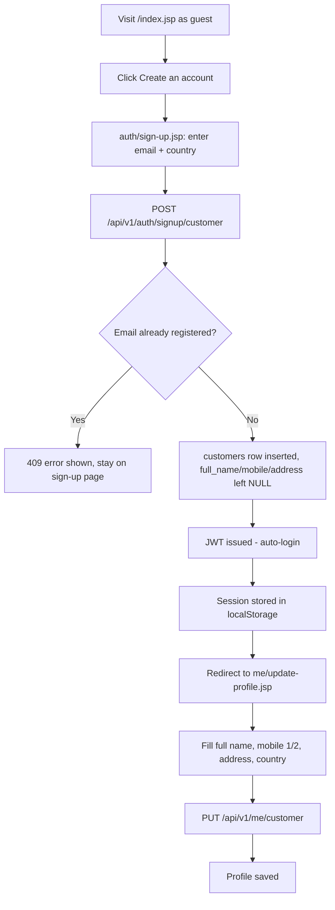

### Returning customer OTP login (TC-C04)

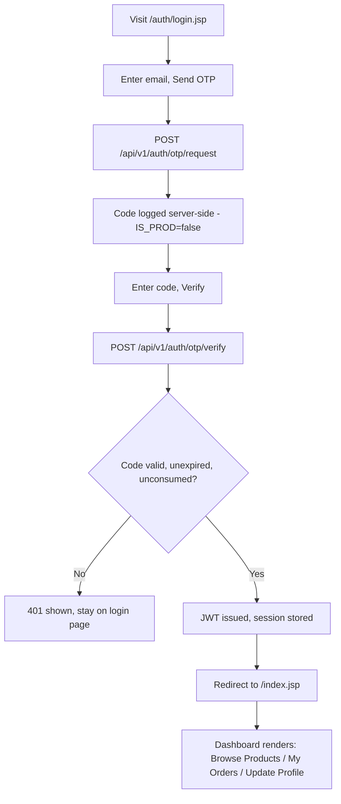

### Browse products (TC-C06)

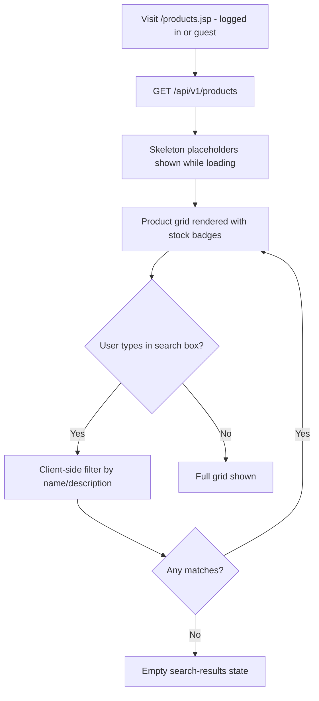

### Place an order (TC-C07, TC-C08, TC-C09)

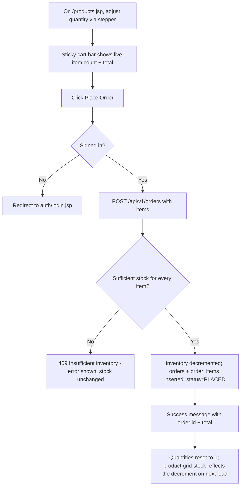

### Order history (TC-C10)

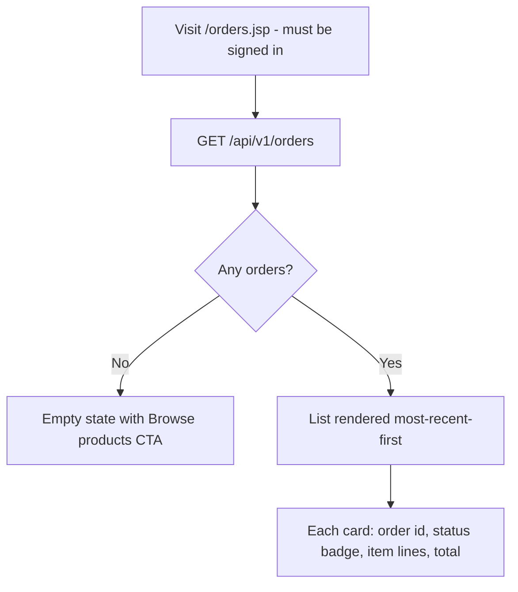

---

## 2. `frontend-seller` Flows

### Supplier sign-up → profile completion (TC-SE02, TC-SE03, TC-SE05)

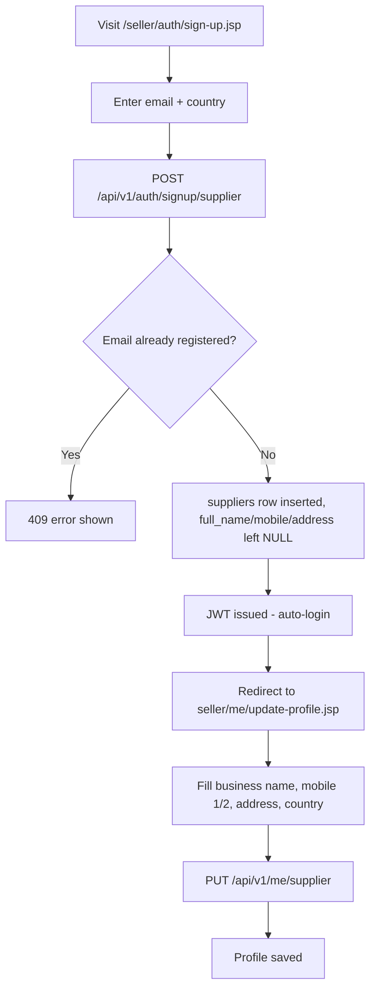

### Returning seller OTP login (TC-SE04)

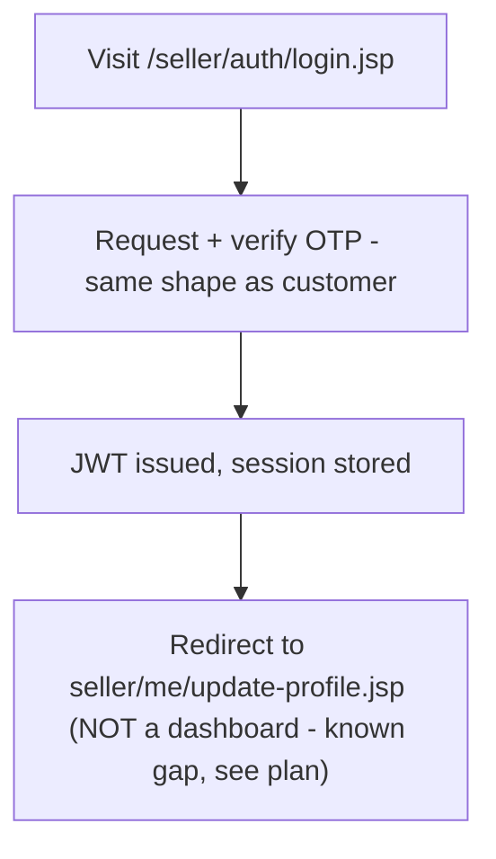

### Add a product offering (TC-SE06)

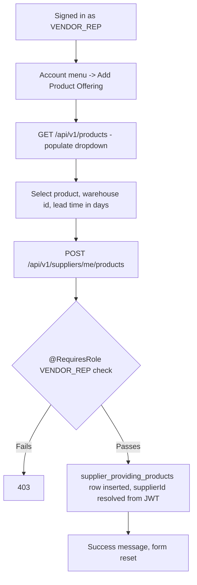

### My Purchase Orders (TC-SE07, TC-SE08)

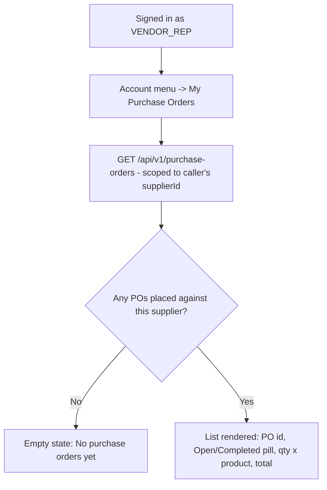

---

## 3. `frontend-app` (Staff Console) Flows

### Staff OTP login → role-based dashboard (TC-A01, TC-A02)

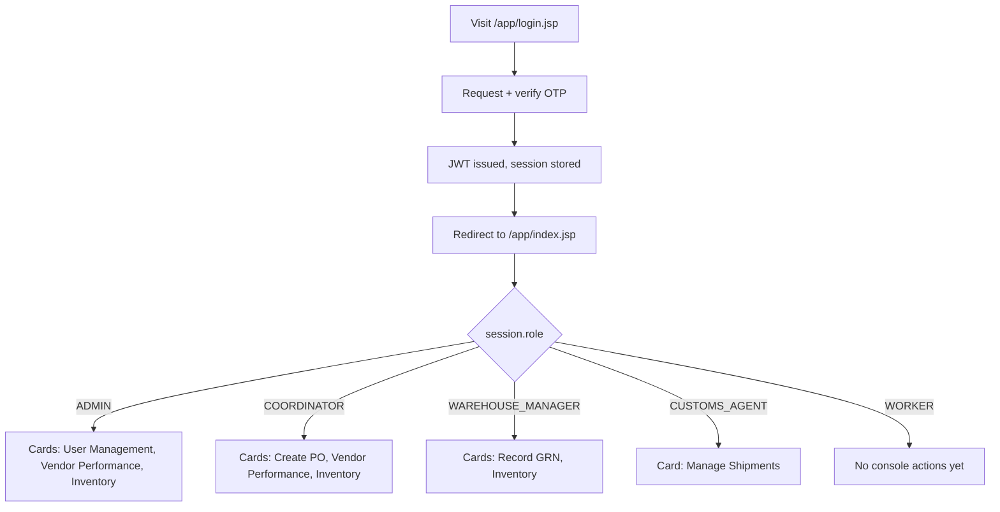

### ADMIN: onboard a staff user (TC-A04)

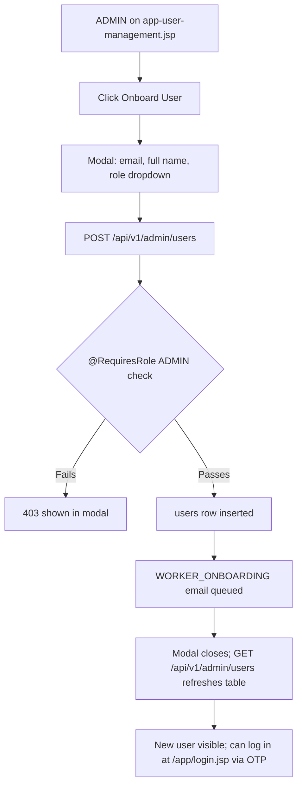

### ADMIN: register a customer or supplier directly (TC-A05, TC-A06)

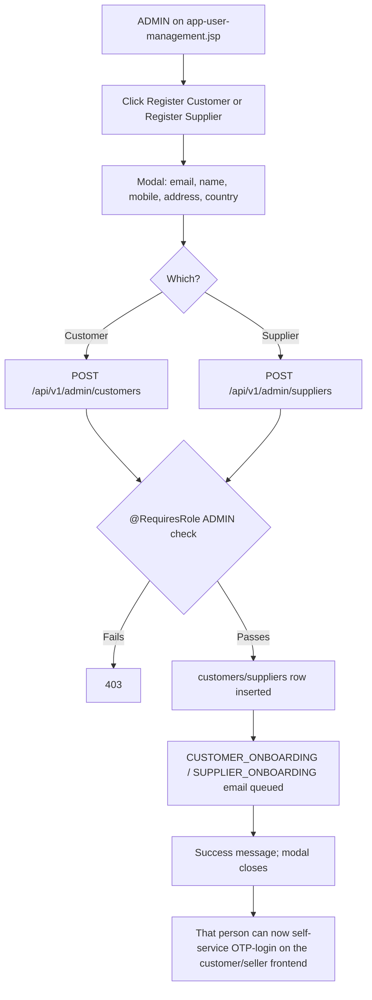

### Vendor Performance Report (TC-A08)

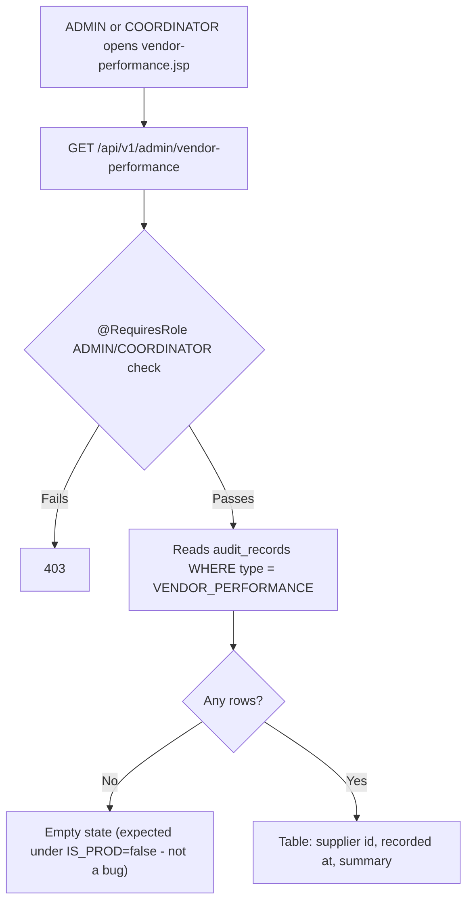

### Warehouse Inventory (TC-A09)

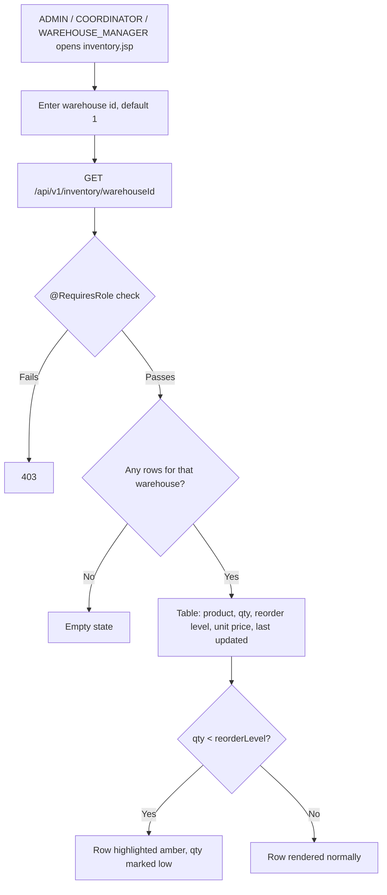

### COORDINATOR: create a purchase order (TC-A11)

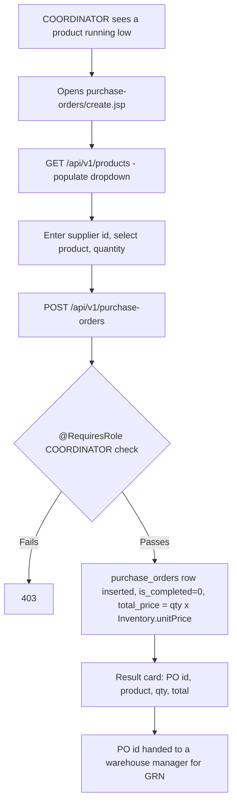

### WAREHOUSE_MANAGER: record a GRN (TC-A13)

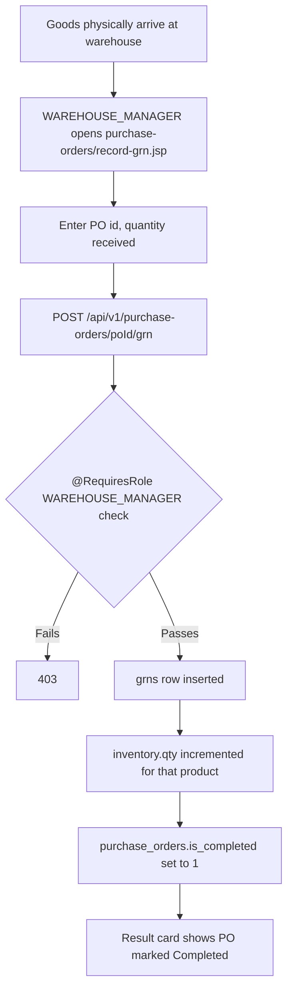

### CUSTOMS_AGENT: manage a shipment (TC-A16, TC-A17, TC-A18)

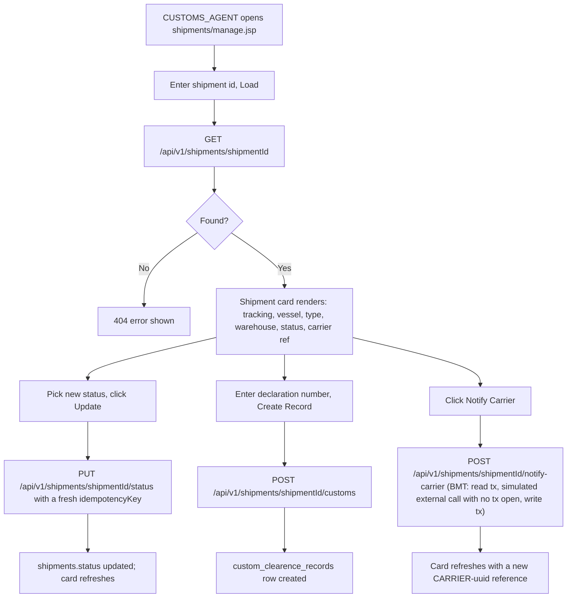

### Role-based page access (CC-5, TC-A12/14/19)

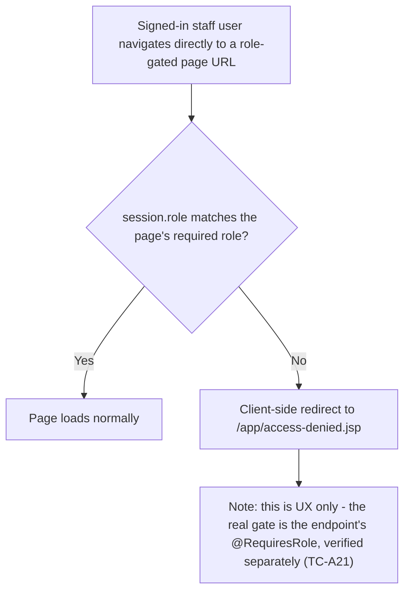

---

## 4. Cross-Actor Integration Chains (§7 of the test plan)

### TC-X01 — Full procurement chain

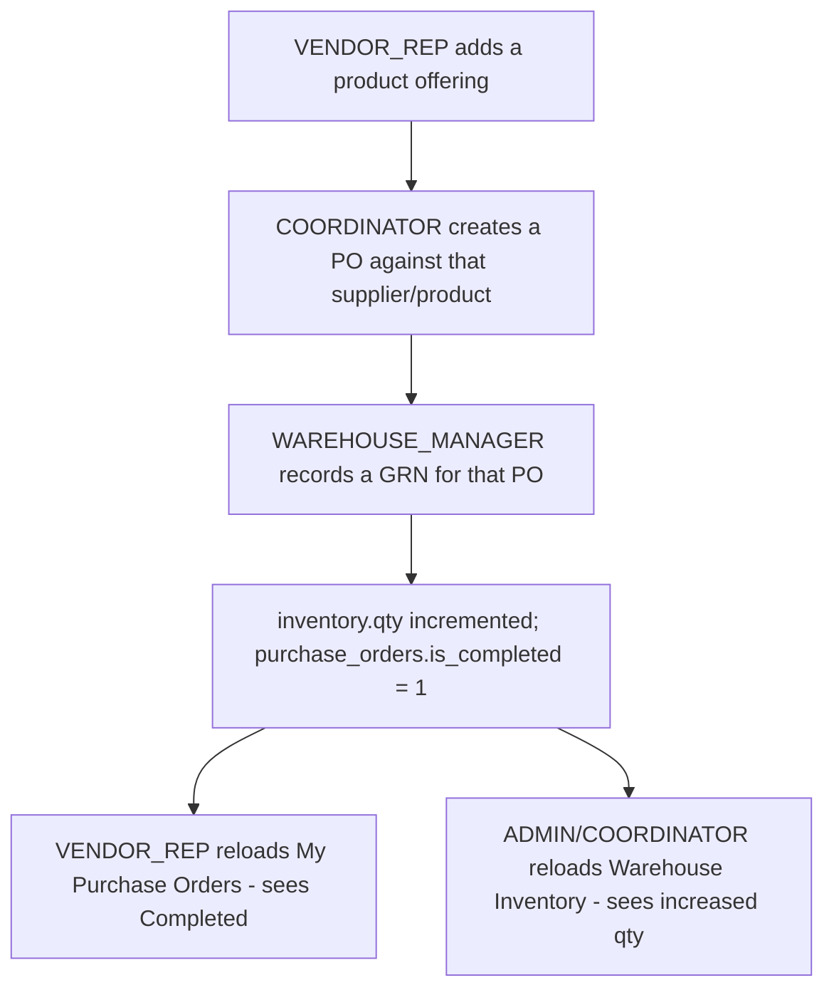

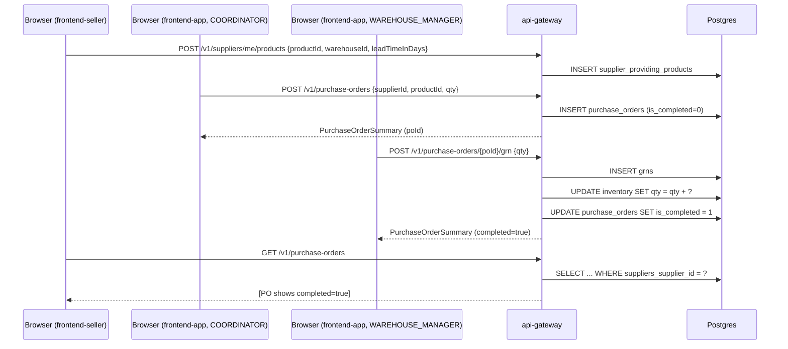

### TC-X02 — Full customer order chain

```mermaid
flowchart TD
    A[Customer notes a product's current stock] --> B[Places an order for a few units]
    B --> C[inventory.qty decremented; orders + order_items inserted]
    C --> D[Reload products.jsp - stock reflects the decrease]
    C --> E[Check orders.jsp - new order shows status PLACED]
    C --> F[ADMIN/COORDINATOR checks Warehouse Inventory - same qty decrease visible there too]
```

```mermaid
sequenceDiagram
    participant Cust as Browser (frontend-customer)
    participant Staff as Browser (frontend-app, ADMIN/COORDINATOR)
    participant GW as api-gateway
    participant DB as Postgres

    Cust->>GW: GET /v1/products
    GW->>DB: SELECT products + best inventory row
    GW-->>Cust: [stock levels shown]

    Cust->>GW: POST /v1/orders {items:[{productId, qty}]}
    GW->>DB: UPDATE inventory SET qty = qty - ?
    GW->>DB: INSERT orders (status=PLACED), INSERT order_items
    GW-->>Cust: OrderSummary

    Cust->>GW: GET /v1/orders
    GW-->>Cust: [new order listed]

    Staff->>GW: GET /v1/inventory/{warehouseId}
    GW->>DB: SELECT inventory WHERE warehouse = ?
    GW-->>Staff: [same decreased qty]
```

### TC-X03 — Shipment lifecycle

```mermaid
flowchart TD
    A[CUSTOMS_AGENT loads shipment 1 - initially IN_TRANSIT] --> B[Updates status to DELAYED]
    B --> C[Creates a customs clearance record]
    C --> D[Notifies the carrier system - gets a CARRIER-uuid ref]
    D --> E[Reload shipment - status and ref both persisted]
    E --> F["Background: a 15-min declarative timer independently polls IN_TRANSIT shipments and may flip status to DELIVERED with no user action"]
```

```mermaid
sequenceDiagram
    participant Agent as Browser (frontend-app, CUSTOMS_AGENT)
    participant GW as api-gateway
    participant LS as logistics-svc
    participant DB as Postgres

    Agent->>GW: GET /v1/shipments/1
    GW->>LS: getShipment(1)
    LS->>DB: SELECT shipments WHERE shipment_id = 1
    GW-->>Agent: ShipmentSummary (IN_TRANSIT)

    Agent->>GW: PUT /v1/shipments/1/status {status: DELAYED, idempotencyKey}
    GW->>LS: updateStatus(1, DELAYED, key)
    LS->>DB: UPDATE shipments SET status = 'DELAYED'
    GW-->>Agent: ShipmentSummary (DELAYED)

    Agent->>GW: POST /v1/shipments/1/customs {declarationNumber}
    GW->>LS: createCustomsRecord(1, declarationNumber)
    LS->>DB: INSERT custom_clearence_records
    GW-->>Agent: 201 Created

    Agent->>GW: POST /v1/shipments/1/notify-carrier
    GW->>LS: notifyCarrierSystem(1)
    Note over LS: BMT bean - read tx, simulated external call<br/>with no tx open, then write tx
    LS->>DB: UPDATE shipments SET ref = 'CARRIER-<uuid>'
    GW-->>Agent: ShipmentSummary (ref populated)
```
