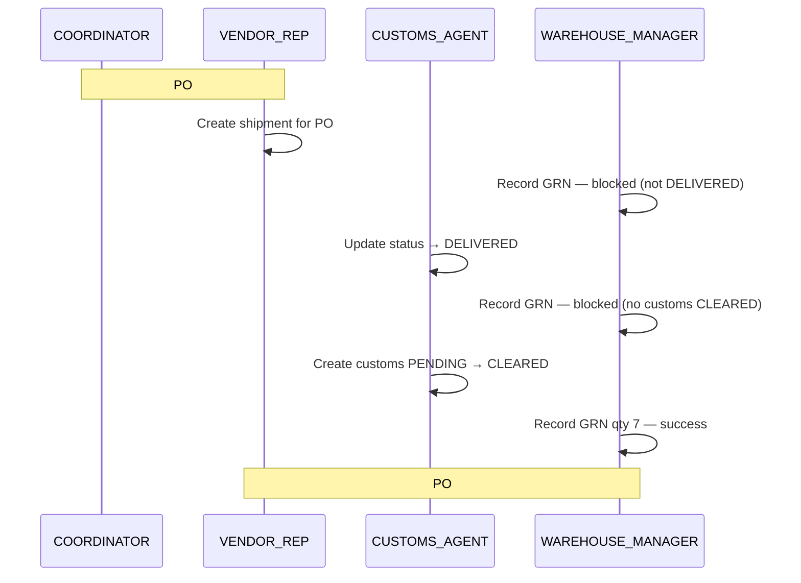

# GlobalTrade Logistics — Procurement-to-Fulfillment E2E Test Flow

A single, continuous, **browser-driven** walkthrough of the full **ship → customs → GRN** pipeline for **PO #1**, across four roles and two frontends (`frontend-app` staff console, `frontend-seller` portal).

Accounts, catalog, and **PO #1** (7 × Steel Pipe for `E2E Supplier Co`) are pre-loaded by [`.no-build/db/test-data.sql`](../db/test-data.sql) — this flow does **not** onboard staff or sign up a supplier first. Every step below is a real click/type/submit in the UI. The only non-UI action is reading a one-time login code from the server log (see §2.3).

Complements [`E2E_TEST_PLAN.md`](./E2E_TEST_PLAN.md) (broader per-page checklist) and [`API_DOCS.md`](./API_DOCS.md).

---

## 1. What this proves

By the end of this flow you will have, entirely through the UI:

1. Confirmed the pre-seeded staff and supplier accounts can OTP-login and see the right dashboards.
2. Confirmed **PO #1** is open and shippable for `e2e.supplier@example.com`.
3. Created a shipment for PO #1 and verified one-PO-one-shipment rules.
4. Confirmed GRN is blocked until the shipment is `DELIVERED`.
5. Confirmed GRN is blocked until customs is `CLEARED` (not merely `PENDING`).
6. Cleared customs and recorded the GRN — PO completed, stock increased, shipment `COMPLETED`.
7. Confirmed the UI prevents duplicate GRN and direct `COMPLETED` status selection.

---

## 2. Prerequisites

### 2.1 Stack up with test data

From the repo root:

```powershell
docker compose down -v          # only needed to reload seed data on an existing volume
docker compose up -d --build
```

Or manually:

```powershell
mysql -h localhost -u gtl_app -pgtl_app global_trade_log_corp < .no-build/db/schema.sql
mysql -h localhost -u gtl_app -pgtl_app global_trade_log_corp < .no-build/db/test-data.sql
```

Confirm health: `curl http://localhost:8080/api/v1/healthz` → `Up and running`.

To reset mid-testing without rebuilding Docker:

```powershell
mysql -h localhost -u gtl_app -pgtl_app global_trade_log_corp < .no-build/db/test-data.sql
```

### 2.2 URLs

| Frontend | URL |
|---|---|
| Staff console | `http://localhost:8080/app/` |
| Seller portal | `http://localhost:8080/seller/` |
| Customer shop | `http://localhost:8080/` |

### 2.3 OTP codes (dev mode)

`IS_PROD=false` — no email is sent. After **Send OTP**, run:

```powershell
docker compose logs app | grep OTP_AUTHENTICATION
```

Take the `code=NNNNNN` from the most recent line for that email.

### 2.4 Debugging

Trace breadcrumbs: [`TRACE_LOGGING.md`](./TRACE_LOGGING.md) — e.g. `docker compose logs app | grep "shipment-7"`.

### 2.5 Starting state (after `test-data.sql`)

This flow uses these fixed ids — **do not change them in the script** if you want step numbers below to match.

| Entity | Id | State relevant to this flow |
|---|---|---|
| **PO #1** | `1` | Open, 7 × Steel Pipe (3m), supplier `E2E Supplier Co` — **no shipment yet** |
| PO #2 | `2` | Open, already has shipment #2 (`CREATED`) — ignore for this walkthrough |
| Shipment #4 | `4` | `DELIVERED` + customs `CLEARED`, PO #5 open — optional GRN shortcut (§6) |
| Steel Pipe stock (Warehouse 1) | product `1` | Qty **480** before this flow's GRN |

**Accounts used in this flow:**

| Email | Role / portal |
|---|---|
| `admin@globaltradelogistics.local` | ADMIN — smoke check only |
| `e2e.coord@example.com` | COORDINATOR |
| `e2e.supplier@example.com` | VENDOR_REP (seller portal) |
| `e2e.wm@example.com` | WAREHOUSE_MANAGER |
| `e2e.customs@example.com` | CUSTOMS_AGENT |

---

## 3. The Flow

Use **PO_ID = 1** throughout. After step 12, note the new **SHIPMENT_ID** from the result card (typically **7** on a fresh seed — six shipments already exist).

---

### Phase A — Smoke-check pre-seeded access (optional, ~5 min)

1. **`/app/login.jsp`** → `admin@globaltradelogistics.local` → OTP → **Verify**.
   - **TP-1**: ADMIN dashboard — cards for User Management, Vendor Performance, Inventory, Shipments.
2. Open **Application User Management**.
   - **TP-2**: Table already lists `e2e.coord@example.com`, `e2e.wm@example.com`, `e2e.customs@example.com` with correct role badges (no onboarding needed).
3. **`/seller/auth/login.jsp`** → `e2e.supplier@example.com` → OTP → **Verify**.
   - **TP-3**: Lands on `/seller/index.jsp` (profile already complete — `E2E Supplier Co`).

---

### Phase B — Coordinator confirms PO #1 exists

4. **`/app/login.jsp`** → `e2e.coord@example.com` → OTP → **Verify**.
   - **TP-4**: COORDINATOR dashboard — Create Purchase Order, Vendor Performance, Inventory, Shipments.
5. Open **Create Purchase Order** (`/app/purchase-orders/create.jsp`).
   - **TP-5**: Supplier dropdown includes **E2E Supplier Co** (not bare emails, not `newvendor@example.com` which has no `fullName`).
6. *(Optional)* Create a **second** PO: same supplier, product **Industrial Bearing**, qty **10** — note the new id if you want extra coverage. **Skip if you only want the scripted PO #1 path.**

> PO **#1** is already in the database (7 × Steel Pipe). You do **not** need to create it — proceed to Phase C. If you prefer to create PO #1 yourself, re-run `test-data.sql` first and delete PO 1 from the script, or use PO #2 after resetting seed.

---

### Phase C — Supplier ships PO #1

7. **`/seller/auth/login.jsp`** → `e2e.supplier@example.com`.
8. Open **Create Shipment** (`/seller/shipments/create.jsp`).
   - **TP-6**: Purchase-order dropdown includes **PO #1** — "7 × Steel Pipe (3m)".
9. Select **PO #1**, Tracking `TRK-E2E`, Vessel `VESSEL-E2E`, Type `Sea` → **Create Shipment**.
   - **TP-7**: Result card shows **SHIPMENT_ID** (call it `<SHIPMENT_ID>`), status `CREATED`, PO #1.
10. Reload **Create Shipment**.
    - **TP-8**: PO #1 **gone** from dropdown — one shipment per PO.
11. Open **My Shipments** (`/seller/shipments/list.jsp`).
    - **TP-9**: Card for `<SHIPMENT_ID>`, status `CREATED`, customs not yet filed.

---

### Phase D — GRN blocked before delivery

12. **`/app/login.jsp`** → `e2e.wm@example.com`.
13. Open **Record GRN** (`/app/purchase-orders/record-grn.jsp`).
    - **TP-10**: `<SHIPMENT_ID>` **not** in the delivered-shipment dropdown (shipment #4 may appear — that's the pre-seeded PO #5 case; ignore it for now).
14. Open **Shipments** (`/app/shipments/list.jsp`).
    - **TP-11**: `<SHIPMENT_ID>` listed as `CREATED`, customs `-`.

---

### Phase E — Customs marks delivered

15. **`/app/login.jsp`** → `e2e.customs@example.com`.
16. Open **Manage Shipments** (`/app/shipments/manage.jsp`) → enter `<SHIPMENT_ID>` → **Load**.
    - **TP-12**: Tracking `TRK-E2E`, PO #1, customs `-`.
17. Under **Update status**: select `DELIVERED` → **Update**.
    - **TP-13**: Status badge `DELIVERED`.

---

### Phase F — GRN blocked until customs cleared

18. As `e2e.wm@example.com` → **Record GRN**.
    - **TP-14**: `<SHIPMENT_ID>` **now in** dropdown (delivered + open PO).
19. Select it, Qty **7** → **Record GRN**.
    - **TP-15**: Error — *"Customs clearance must be completed (CLEARED) before a GRN can be recorded…"* PO #1 stays open; stock unchanged.

---

### Phase G — Customs clearance

20. As `e2e.customs@example.com` → **Manage Shipments** → load `<SHIPMENT_ID>`.
21. **Record customs clearance**: Declaration `DECL-E2E` → **Create Record**.
    - **TP-16**: Customs status `PENDING`.
22. As `e2e.wm@example.com` → **Record GRN** → `<SHIPMENT_ID>`, qty **7**.
    - **TP-17**: Same customs error — `PENDING` is not enough.
23. As `e2e.customs@example.com` → load `<SHIPMENT_ID>` → **Update customs status** → `CLEARED`.
    - **TP-18**: Customs status `CLEARED`.

---

### Phase H — GRN succeeds

24. As `e2e.wm@example.com` → **Record GRN** → `<SHIPMENT_ID>`, qty **7** → **Record GRN**.
    - **TP-19**: Success — PO #1 marked completed, product Steel Pipe (3m).
25. Reload **Record GRN**.
    - **TP-20**: `<SHIPMENT_ID>` **removed** from dropdown — duplicate GRN impossible from UI.

---

### Phase I — Verify final state

26. **Warehouse Inventory** (`/app/inventory.jsp`) → Warehouse 1 (US).
    - **TP-21**: Steel Pipe (3m) qty **487** (was **480** + **7** from GRN).
27. **Shipments** (`/app/shipments/list.jsp`) — any staff role above.
    - **TP-22**: `<SHIPMENT_ID>` status `COMPLETED`, customs `CLEARED`.
28. As `e2e.customs@example.com` → **Manage Shipments** → load `<SHIPMENT_ID>`.
    - **TP-23**: Status dropdown has no `COMPLETED` option — only GRN sets that.
29. As `e2e.supplier@example.com` → **My Shipments**.
    - **TP-24**: Shipment shows `COMPLETED` / customs `CLEARED`.

---

## 4. Test point summary

| TP | Confirms |
|---|---|
| 1–3 | Pre-seeded ADMIN / staff / supplier OTP login works |
| 4–5 | COORDINATOR dashboard; supplier list filters incomplete profiles |
| 6–9 | PO #1 shippable; shipment created; one-shipment-per-PO enforced |
| 10–11 | GRN impossible before `DELIVERED` |
| 12–13 | Customs agent can load shipment and set `DELIVERED` |
| 14–15 | GRN rejected without customs `CLEARED` |
| 16–18 | Customs record lifecycle `PENDING` → `CLEARED` |
| 19–20 | GRN succeeds; UI blocks second GRN |
| 21–24 | Inventory + shipment + supplier views reflect completion |

---

## 5. Optional shortcuts (same seed file)

### 5.1 GRN-only path (shipment #4)

Skip Phases C–G. Log in as `e2e.wm@example.com` → **Record GRN** → select shipment **#4** (`TRK-PO5-OVERDUE`, already `DELIVERED` + customs `CLEARED`) → qty **200** → submit. Confirms the happy-path GRN without walking customs first.

### 5.2 Customer purchase (third frontend)

1. `http://localhost:8080/` → browse products (Steel Pipe qty 480+).
2. **`/auth/login.jsp`** → `alice@example.com` → OTP.
3. Place order for Steel Pipe × 2 → confirm stock decrements on **Warehouse Inventory**.

### 5.3 Vendor performance report

As `e2e.coord@example.com` → **Vendor Performance Report** — table shows pre-seeded audit rows for suppliers 1–3 (type `VENDOR_PERFORMANCE`).

### 5.4 Admin onboard a new worker

As `admin@globaltradelogistics.local` → onboard `new.worker@example.com` / `New Worker` / `WORKER` — only needed if testing HR onboarding; not part of the core PO #1 pipeline.

---

## 6. Flow diagram



---

## 7. Reset and re-run

```powershell
mysql -h localhost -u gtl_app -pgtl_app global_trade_log_corp < .no-build/db/test-data.sql
```

Then start again at Phase A (or Phase C if skipping smoke checks). PO #1 will again have no shipment.

---

## 8. Verification note

Steps map to live API endpoints documented in [`API_DOCS.md`](./API_DOCS.md). If a step fails in the browser, grep `[TRACE]` / `[WARN]` for the acting user's email and the entity id (`po-1`, `shipment-7`, etc.) before assuming a UI bug — see [`TRACE_LOGGING.md`](./TRACE_LOGGING.md).
